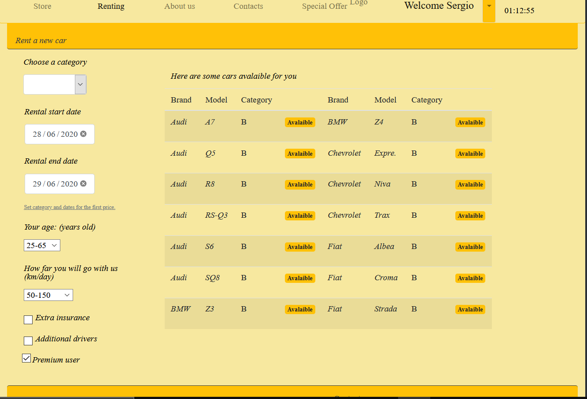
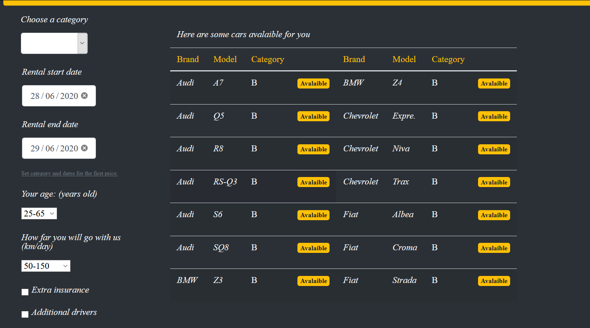

<form class="inline-form" action="/polito-AW1-exams/esame1-noleggio-auto-Sergio235705/delete/master/README.md" accept-charset="UTF-8" method="post"><input type="hidden" name="authenticity_token" value="kmnjXCiDUQHKAl6uw1MHIHbzGclw+bDchsxt7kicdwYfz4Edf4rAgJSVQZIbFoY2vVqViSrOccGPWr/LCQpUcg==" />
            <button class="btn-octicon btn-octicon-danger tooltipped tooltipped-nw" type="submit"
              aria-label="Delete this file" data-disable-with>
              <svg class="octicon octicon-trashcan" viewBox="0 0 16 16" version="1.1" width="16" height="16" aria-hidden="true"><path fill-rule="evenodd" d="M6.5 1.75a.25.25 0 01.25-.25h2.5a.25.25 0 01.25.25V3h-3V1.75zm4.5 0V3h2.25a.75.75 0 010 1.5H2.75a.75.75 0 010-1.5H5V1.75C5 .784 5.784 0 6.75 0h2.5C10.216 0 11 .784 11 1.75zM4.496 6.675a.75.75 0 10-1.492.15l.66 6.6A1.75 1.75 0 005.405 15h5.19c.9 0 1.652-.681 1.741-1.576l.66-6.6a.75.75 0 00-1.492-.149l-.66 6.6a.25.25 0 01-.249.225h-5.19a.25.25 0 01-.249-.225l-.66-6.6z"></path></svg>
            </button>
</form>    

  

      
  

    <article class="markdown-body entry-content container-lg" itemprop="text"><h1><a id="user-content-exam-1-noleggio-auto-29-06-2020" class="anchor" aria-hidden="true" href="#exam-1-noleggio-auto-29-06-2020"><svg class="octicon octicon-link" viewBox="0 0 16 16" version="1.1" width="16" height="16" aria-hidden="true"><path fill-rule="evenodd" d="M7.775 3.275a.75.75 0 001.06 1.06l1.25-1.25a2 2 0 112.83 2.83l-2.5 2.5a2 2 0 01-2.83 0 .75.75 0 00-1.06 1.06 3.5 3.5 0 004.95 0l2.5-2.5a3.5 3.5 0 00-4.95-4.95l-1.25 1.25zm-4.69 9.64a2 2 0 010-2.83l2.5-2.5a2 2 0 012.83 0 .75.75 0 001.06-1.06 3.5 3.5 0 00-4.95 0l-2.5 2.5a3.5 3.5 0 004.95 4.95l1.25-1.25a.75.75 0 00-1.06-1.06l-1.25 1.25a2 2 0 01-2.83 0z"></path></svg></a>Exam #1: Noleggio-Auto 29-06-2020</h1>
<h2><a id="user-content-student-s269486" class="anchor" aria-hidden="true" href="#student-s269486"><svg class="octicon octicon-link" viewBox="0 0 16 16" version="1.1" width="16" height="16" aria-hidden="true"><path fill-rule="evenodd" d="M7.775 3.275a.75.75 0 001.06 1.06l1.25-1.25a2 2 0 112.83 2.83l-2.5 2.5a2 2 0 01-2.83 0 .75.75 0 00-1.06 1.06 3.5 3.5 0 004.95 0l2.5-2.5a3.5 3.5 0 00-4.95-4.95l-1.25 1.25zm-4.69 9.64a2 2 0 010-2.83l2.5-2.5a2 2 0 012.83 0 .75.75 0 001.06-1.06 3.5 3.5 0 00-4.95 0l-2.5 2.5a3.5 3.5 0 004.95 4.95l1.25-1.25a.75.75 0 00-1.06-1.06l-1.25 1.25a2 2 0 01-2.83 0z"></path></svg></a>Student: s269486</h2>
<h2><a id="user-content-react-client-application-routes" class="anchor" aria-hidden="true" href="#react-client-application-routes"><svg class="octicon octicon-link" viewBox="0 0 16 16" version="1.1" width="16" height="16" aria-hidden="true"><path fill-rule="evenodd" d="M7.775 3.275a.75.75 0 001.06 1.06l1.25-1.25a2 2 0 112.83 2.83l-2.5 2.5a2 2 0 01-2.83 0 .75.75 0 00-1.06 1.06 3.5 3.5 0 004.95 0l2.5-2.5a3.5 3.5 0 00-4.95-4.95l-1.25 1.25zm-4.69 9.64a2 2 0 010-2.83l2.5-2.5a2 2 0 012.83 0 .75.75 0 001.06-1.06 3.5 3.5 0 00-4.95 0l-2.5 2.5a3.5 3.5 0 004.95 4.95l1.25-1.25a.75.75 0 00-1.06-1.06l-1.25 1.25a2 2 0 01-2.83 0z"></path></svg></a>React client application routes</h2>
<ul>
<li>Route <code>/</code>: riporta alla pagina princiale '/store'</li>
<li>Route <code>/store</code>: pagina principale di visione delle auto disponibili con filtro per categoria e brand</li>
<li>Route <code>/login</code>: pagina di login</li>
<li>Route <code>/newrental</code>: configuratore interattivo per il prezzo e l'affitto dell'auto (accessibile solo da autenticato)</li>
<li>Route <code>/register</code>: pagina di registrazione</li>
<li>Route <code>/aboutus</code>: pagina di informazioni</li>
<li>Route <code>/specialoffer</code>: pagina di informazioni sulle offerte</li>
<li>Route <code>/contacts</code>: pagina di contatti con form per richiesta via email</li>
<li>Route <code>/newrental/stub</code>: pagina per l'inserimento dei dati di pagamento ( con conclusione del noleggio)</li>
<li>Route <code>/personal/reports</code>: pagina di report con form per richiesta via email ( accessibile solo da autenticato)</li>
<li>Route <code>/personal/reservations</code>: pagina con la lista dei noleggi in corso e futuri ( cancellabili) (accessibile solo da autenticato)</li>
<li>Route <code>/personal/history</code>: pagina con la lista dei noleggi passati (accessibile solo da autenticato)</li>
<li>Route <code>/personal/cov</code>: pagina di informazioni (accessibile solo da autenticato)</li>
</ul>
<h2><a id="user-content-rest-api-server" class="anchor" aria-hidden="true" href="#rest-api-server"><svg class="octicon octicon-link" viewBox="0 0 16 16" version="1.1" width="16" height="16" aria-hidden="true"><path fill-rule="evenodd" d="M7.775 3.275a.75.75 0 001.06 1.06l1.25-1.25a2 2 0 112.83 2.83l-2.5 2.5a2 2 0 01-2.83 0 .75.75 0 00-1.06 1.06 3.5 3.5 0 004.95 0l2.5-2.5a3.5 3.5 0 00-4.95-4.95l-1.25 1.25zm-4.69 9.64a2 2 0 010-2.83l2.5-2.5a2 2 0 012.83 0 .75.75 0 001.06-1.06 3.5 3.5 0 00-4.95 0l-2.5 2.5a3.5 3.5 0 004.95 4.95l1.25-1.25a.75.75 0 00-1.06-1.06l-1.25 1.25a2 2 0 01-2.83 0z"></path></svg></a>REST API server</h2>
<ul>
<li>POST <code>api/login</code>
<ul>
<li>request : body: username - password</li>
<li>response : body: username - name - Premium (boolean)</li>
</ul>
</li>
<li>POST <code>api/registration</code>
<ul>
<li>request : body: username - password - nome</li>
<li>response : body: -</li>
</ul>
</li>
<li>POST <code>api/logout</code>
<ul>
<li>request : -</li>
<li>response : -</li>
</ul>
</li>
<li>POST <code>api/newusername</code>
<ul>
<li>request : body: username</li>
<li>response : 1 (username valido ) / -1 (username non valido)</li>
</ul>
</li>
<li>GET <code>/api/cars/brands</code>
<ul>
<li>request : -</li>
<li>response : body: lista di marche</li>
</ul>
</li>
<li>GET <code>/api/cars/filter/category:c&amp;brand=:brand/record=:r&amp;offset:p</code>
<ul>
<li>request : Parametri : :c Categoria ,:brand Marca , :r numero di record richiesti, :p pagina</li>
<li>response : body: lista di auto</li>
</ul>
</li>
<li>POST <code>/api/users/:user/newrental/validpayment</code>
<ul>
<li>request : Parametri : :user username(tagliato alla @) , body: dati della carta( carta , ccv , data , name, lastname)</li>
<li>response : true (pagamento valido ) / false (pagamento non valido)</li>
</ul>
</li>
<li>GET <code>/api/user</code>
<ul>
<li>request : -</li>
<li>response : body: username - name - Premium (boolean)</li>
</ul>
</li>
<li>GET <code>/api/users/:user/rentals/past=:res</code>
<ul>
<li>request : Parametri: :res 1 noleggi passati / 0 noleggi in corso o futuri ,:user username(tagliato alla @)</li>
<li>response : body : lista di noleggi</li>
</ul>
</li>
<li>GET <code>/api/users/:user/findcars/category=:cat&amp;datebegin=:DB&amp;dateend=:DE/record=:r&amp;offset=:p</code>
<ul>
<li>request : Parametri : :cat Categoria , :DB data inizio , :DE datafine , :r numero di record richiesti, :p pagina ,:user username(tagliato alla @)</li>
<li>response : body: numcars (numero modelli), carsavalaible ( lista auto disponibili), numnotmodel (numero totale auto)</li>
</ul>
</li>
<li>POST <code>/api/users/:user/findprice/category=:cat&amp;datebegin=:DB&amp;dateend=:DE/record=:r&amp;offset=:p</code>
<ul>
<li>request : Parametri : :cat Categoria , :DB data inizio , :DE datafine , :r numero di record richiesti, :p pagina, :user username(tagliato alla @)
body: ParamPrice={Categoria:"",NumDays: , KmGiornalieri: , AgeDriver: , ExtraAss: , NumDriverAdd: , User: }</li>
<li>response : body : prezzo</li>
</ul>
</li>
<li>POST <code>/api/users/:user/addrental</code>
<ul>
<li>request : Parametri : :user username(tagliato alla @) ,body :  {rent={Marca: , Modello: , DataInizio: , DataFine: } ,
Price={Categoria:"",NumDays: , KmGiornalieri: , AgeDriver: , ExtraAss: , NumDriverAdd: , User: }}</li>
<li>response :</li>
</ul>
</li>
<li>DELETE  <code>/api/users/:user/rentals/delete:idRent</code>
<ul>
<li>request : Parametri : :idRent ID Prenotazione ,:user username(tagliato alla @)</li>
<li>response: -1 se il noleggio è in corso</li>
</ul>
</li>
</ul>
<h2><a id="user-content-server-database" class="anchor" aria-hidden="true" href="#server-database"><svg class="octicon octicon-link" viewBox="0 0 16 16" version="1.1" width="16" height="16" aria-hidden="true"><path fill-rule="evenodd" d="M7.775 3.275a.75.75 0 001.06 1.06l1.25-1.25a2 2 0 112.83 2.83l-2.5 2.5a2 2 0 01-2.83 0 .75.75 0 00-1.06 1.06 3.5 3.5 0 004.95 0l2.5-2.5a3.5 3.5 0 00-4.95-4.95l-1.25 1.25zm-4.69 9.64a2 2 0 010-2.83l2.5-2.5a2 2 0 012.83 0 .75.75 0 001.06-1.06 3.5 3.5 0 00-4.95 0l-2.5 2.5a3.5 3.5 0 004.95 4.95l1.25-1.25a.75.75 0 00-1.06-1.06l-1.25 1.25a2 2 0 01-2.83 0z"></path></svg></a>Server database</h2>
<ul>
<li>Tabella <code>user</code> - contiene IDUser(email),password,name,NumPren ( numero prenotazioni)</li>
<li>Tabella <code>Prenotazioni</code> - contiene IDPrenotazione,MarcaAuto,Modello,DataInizioNoleggio,DataFineNoleggio,Targa</li>
<li>Tabella  <code>NoleggiUser</code> - contiene IDPrenotazione,IDUser,Importo</li>
<li>Tabella  <code>VeicoliDisponibili</code> - contiene Marca,Modello,Categoria,Targa</li>
</ul>
<h2><a id="user-content-main-react-components" class="anchor" aria-hidden="true" href="#main-react-components"><svg class="octicon octicon-link" viewBox="0 0 16 16" version="1.1" width="16" height="16" aria-hidden="true"><path fill-rule="evenodd" d="M7.775 3.275a.75.75 0 001.06 1.06l1.25-1.25a2 2 0 112.83 2.83l-2.5 2.5a2 2 0 01-2.83 0 .75.75 0 00-1.06 1.06 3.5 3.5 0 004.95 0l2.5-2.5a3.5 3.5 0 00-4.95-4.95l-1.25 1.25zm-4.69 9.64a2 2 0 010-2.83l2.5-2.5a2 2 0 012.83 0 .75.75 0 001.06-1.06 3.5 3.5 0 00-4.95 0l-2.5 2.5a3.5 3.5 0 004.95 4.95l1.25-1.25a.75.75 0 00-1.06-1.06l-1.25 1.25a2 2 0 01-2.83 0z"></path></svg></a>Main React Components</h2>
<ul>
<li><code>BarIcon</code> (in <code>BarIcon.js</code>):  barra in alto con icone</li>
<li><code>BaseBars</code> (in <code>BaseBars.js</code>):  barra di navigazione</li>
<li><code>FooterPage</code> (in <code>BaseBars.js</code>): footer della pagina</li>
<li><code>Page_Rentals</code> (in <code>BMainContent.js</code>): layout e funzionalità(cancellazione) per lista noleggi</li>
<li><code>Login</code> (in <code>LoginComponent.js</code>): componente del Login con funzionalità e alert</li>
<li><code>Page_Store_Rent_Offer</code> (in <code>BMainContent.js</code>): layout pagina di '/store','/newrental','/specialoffer'</li>
<li><code>FormStore</code>  (in <code>BMainContent.js</code>): Form di filtro categoria/Brand</li>
<li><code>FormRent</code>  (in <code>BMainContent.js</code>): Configuratore noleggio con bottone per dirigersi al pagamento( pagina stub)</li>
<li><code>ListCars</code>  (in <code>BMainContent.js</code>): Wrapper per la tabella delle auto</li>
<li><code>PrinTable</code> (in <code>CarsTableComponents.js</code>):  layout della tabella auto : Titolo Tabella e paginazione</li>
<li><code>RentTable</code> (in <code>RentTableComponent.js</code>): Tabella noleggi con icone</li>
<li><code>CarsTable</code> (in <code>CarsTableComponents.js</code>): Tabella Auto
(only <em>main</em> components)</li>
</ul>
<h2><a id="user-content-screenshot" class="anchor" aria-hidden="true" href="#screenshot"><svg class="octicon octicon-link" viewBox="0 0 16 16" version="1.1" width="16" height="16" aria-hidden="true"><path fill-rule="evenodd" d="M7.775 3.275a.75.75 0 001.06 1.06l1.25-1.25a2 2 0 112.83 2.83l-2.5 2.5a2 2 0 01-2.83 0 .75.75 0 00-1.06 1.06 3.5 3.5 0 004.95 0l2.5-2.5a3.5 3.5 0 00-4.95-4.95l-1.25 1.25zm-4.69 9.64a2 2 0 010-2.83l2.5-2.5a2 2 0 012.83 0 .75.75 0 001.06-1.06 3.5 3.5 0 00-4.95 0l-2.5 2.5a3.5 3.5 0 004.95 4.95l1.25-1.25a.75.75 0 00-1.06-1.06l-1.25 1.25a2 2 0 01-2.83 0z"></path></svg></a>Screenshot</h2>

light mode

dark mode

<h2><a id="user-content-suggerimenti-per-le-funzionalità" class="anchor" aria-hidden="true" href="#suggerimenti-per-le-funzionalità"><svg class="octicon octicon-link" viewBox="0 0 16 16" version="1.1" width="16" height="16" aria-hidden="true"><path fill-rule="evenodd" d="M7.775 3.275a.75.75 0 001.06 1.06l1.25-1.25a2 2 0 112.83 2.83l-2.5 2.5a2 2 0 01-2.83 0 .75.75 0 00-1.06 1.06 3.5 3.5 0 004.95 0l2.5-2.5a3.5 3.5 0 00-4.95-4.95l-1.25 1.25zm-4.69 9.64a2 2 0 010-2.83l2.5-2.5a2 2 0 012.83 0 .75.75 0 001.06-1.06 3.5 3.5 0 00-4.95 0l-2.5 2.5a3.5 3.5 0 004.95 4.95l1.25-1.25a.75.75 0 00-1.06-1.06l-1.25 1.25a2 2 0 01-2.83 0z"></path></svg></a>Suggerimenti per le funzionalità</h2>

Nel db son già presenti vari noleggi della Auto di categoria D nel periodo intorno il 29 Giugno - 3 Luglio
Insistendo ad affittare in quel periodo quella categoria si dovrebbe arrivare a mostrare l'indisponibilità delle auto

<h2><a id="user-content-test-users" class="anchor" aria-hidden="true" href="#test-users"><svg class="octicon octicon-link" viewBox="0 0 16 16" version="1.1" width="16" height="16" aria-hidden="true"><path fill-rule="evenodd" d="M7.775 3.275a.75.75 0 001.06 1.06l1.25-1.25a2 2 0 112.83 2.83l-2.5 2.5a2 2 0 01-2.83 0 .75.75 0 00-1.06 1.06 3.5 3.5 0 004.95 0l2.5-2.5a3.5 3.5 0 00-4.95-4.95l-1.25 1.25zm-4.69 9.64a2 2 0 010-2.83l2.5-2.5a2 2 0 012.83 0 .75.75 0 001.06-1.06 3.5 3.5 0 00-4.95 0l-2.5 2.5a3.5 3.5 0 004.95 4.95l1.25-1.25a.75.75 0 00-1.06-1.06l-1.25 1.25a2 2 0 01-2.83 0z"></path></svg></a>Test users</h2>
<ul>
<li>username: <a href="mailto:Sergio12@Gertz.com">Sergio12@Gertz.com</a> , password: AW2906   (frequent customer)</li>
<li>username: <a href="mailto:Diba98@Gertz.com">Diba98@Gertz.com</a> , password:  JAVASCRIPT</li>
<li>username: <a href="mailto:Dan10@Gertz.com">Dan10@Gertz.com</a> , password: AW2906 (frequent customer)</li>
<li>username: <a href="mailto:JonCip@Gertz.com">JonCip@Gertz.com</a> , password: REACT</li>
<li>username: <a href="mailto:Frank11@Gertz.com">Frank11@Gertz.com</a> , password: REACT</li>
<li>username: <a href="mailto:Fra12@Gertz.com">Fra12@Gertz.com</a> , password: REACT1</li>
<li>username <a href="mailto:Carl1@Gertz.com">Carl1@Gertz.com</a> , password: REACT1</li>
<li>username: <a href="mailto:Maria1@Gertz.com">Maria1@Gertz.com</a> , password: AW2906</li>
<li>username: <a href="mailto:Silvia00@Gertz.com">Silvia00@Gertz.com</a> , password: AW2906</li>
<li>username: <a href="mailto:Alessio13@Gertz.com">Alessio13@Gertz.com</a> , password: REACT</li>
</ul>
</article>
  

