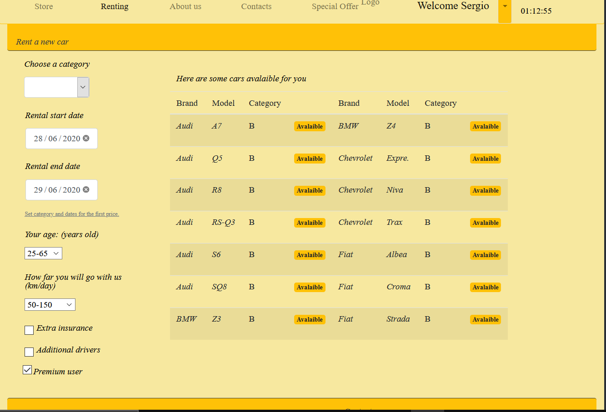

# Exam #1: Noleggio-Auto 29-06-2020
## Student: s269486

## React client application routes

- Route `/`: riporta alla pagina princiale '/store'
- Route `/store`: pagina principale di visione delle auto disponibili con filtro per categoria e brand
- Route `/login`: pagina di login
- Route `/newrental`: configuratore interattivo per il prezzo e l'affitto dell'auto (accessibile solo da autenticato)
- Route `/register`: pagina di registrazione
- Route `/aboutus`: pagina di informazioni
- Route `/specialoffer`: pagina di informazioni sulle offerte 
- Route `/contacts`: pagina di contatti con form per richiesta via email
- Route `/newrental/stub`: pagina per l'inserimento dei dati di pagamento ( con conclusione del noleggio)
- Route `/personal/reports`: pagina di report con form per richiesta via email ( accessibile solo da autenticato)
- Route `/personal/reservations`: pagina con la lista dei noleggi in corso e futuri ( cancellabili) (accessibile solo da autenticato)
- Route `/personal/history`: pagina con la lista dei noleggi passati (accessibile solo da autenticato)
- Route `/personal/cov`: pagina di informazioni (accessibile solo da autenticato)

## REST API server

- POST `api/login`
  - request : body: username - password
  - response : body: username - name - Premium (boolean)
- POST `api/registration`
  - request : body: username - password - nome
  - response : body: -
- POST `api/logout`
  - request : -
  - response : -
- POST `api/newusername`
  - request : body: username 
  - response : 1 (username valido ) / -1 (username non valido)
- GET `/api/cars/brands`
  - request : -
  - response : body: lista di marche 
- GET `/api/cars/filter/category:c&brand=:brand/record=:r&offset:p`
   - request : Parametri : :c Categoria ,:brand Marca , :r numero di record richiesti, :p pagina
   - response : body: lista di auto 
- POST `/api/users/:user/newrental/validpayment`
   - request : Parametri : :user username(tagliato alla @) , body: dati della carta( carta , ccv , data , name, lastname)
   - response : true (pagamento valido ) / false (pagamento non valido)
- GET `/api/user`
  - request : -
  - response : body: username - name - Premium (boolean)
- GET `/api/users/:user/rentals/past=:res`
  - request : Parametri: :res 1 noleggi passati / 0 noleggi in corso o futuri ,:user username(tagliato alla @)
  - response : body : lista di noleggi
- GET `/api/users/:user/findcars/category=:cat&datebegin=:DB&dateend=:DE/record=:r&offset=:p`
  - request : Parametri : :cat Categoria , :DB data inizio , :DE datafine , :r numero di record richiesti, :p pagina ,:user username(tagliato alla @)
  - response : body: numcars (numero modelli), carsavalaible ( lista auto disponibili), numnotmodel (numero totale auto)
- POST `/api/users/:user/findprice/category=:cat&datebegin=:DB&dateend=:DE/record=:r&offset=:p`
  - request : Parametri : :cat Categoria , :DB data inizio , :DE datafine , :r numero di record richiesti, :p pagina, :user username(tagliato alla @)
                        body: ParamPrice={Categoria:"",NumDays: , KmGiornalieri: , AgeDriver: , ExtraAss: , NumDriverAdd: , User: }
  - response : body : prezzo
- POST `/api/users/:user/addrental`
  - request : Parametri : :user username(tagliato alla @) ,body :  {rent={Marca: , Modello: , DataInizio: , DataFine: } ,
      Price={Categoria:"",NumDays: , KmGiornalieri: , AgeDriver: , ExtraAss: , NumDriverAdd: , User: }}
  - response : 
- DELETE  `/api/users/:user/rentals/delete:idRent`
  - request : Parametri : :idRent ID Prenotazione ,:user username(tagliato alla @)
  - response: -1 se il noleggio è in corso 
## Server database

- Tabella `user` - contiene IDUser(email),password,name,NumPren ( numero prenotazioni)
- Tabella `Prenotazioni` - contiene IDPrenotazione,MarcaAuto,Modello,DataInizioNoleggio,DataFineNoleggio,Targa
- Tabella  `NoleggiUser` - contiene IDPrenotazione,IDUser,Importo
- Tabella  `VeicoliDisponibili` - contiene Marca,Modello,Categoria,Targa
## Main React Components

- `BarIcon` (in `BarIcon.js`):  barra in alto con icone 
- `BaseBars` (in `BaseBars.js`):  barra di navigazione
- `FooterPage` (in `BaseBars.js`): footer della pagina
- `Page_Rentals` (in `BMainContent.js`): layout e funzionalità(cancellazione) per lista noleggi
- `Login` (in `LoginComponent.js`): componente del Login con funzionalità e alert
- `Page_Store_Rent_Offer` (in `BMainContent.js`): layout pagina di '/store','/newrental','/specialoffer'
- `FormStore`  (in `BMainContent.js`): Form di filtro categoria/Brand
- `FormRent`  (in `BMainContent.js`): Configuratore noleggio con bottone per dirigersi al pagamento( pagina stub)
- `ListCars`  (in `BMainContent.js`): Wrapper per la tabella delle auto
- `PrinTable` (in `CarsTableComponents.js`):  layout della tabella auto : Titolo Tabella e paginazione
- `RentTable` (in `RentTableComponent.js`): Tabella noleggi con icone
- `CarsTable` (in `CarsTableComponents.js`): Tabella Auto 
(only _main_ components)
## Screenshot
light mode

dark mode

## Test users
* username: Sergio12@Gertz.com , password: AW2906   (frequent customer)
* username: Diba98@Gertz.com , password:  JAVASCRIPT
* username: Dan10@Gertz.com , password: AW2906 (frequent customer)
* username: JonCip@Gertz.com , password: REACT
* username: Frank11@Gertz.com , password: REACT
* username: Fra12@Gertz.com , password: REACT1
* username Carl1@Gertz.com , password: REACT1
* username: Maria1@Gertz.com , password: AW2906
* username: Silvia00@Gertz.com , password: AW2906
* username: Alessio13@Gertz.com , password: REACT
